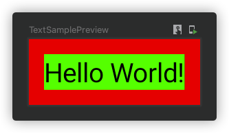
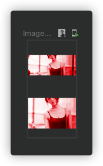

Modifiers 可以修饰一个 composable。

在前面基础组件中，可能或多或少见过 Modifier，但不知道它是干什么的，那么这一节我们来看看 Modifier 到底能做哪些事情呢！

- 改变 composable 的尺寸、布局、动作和外观
- 添加信息，比如无障碍辅助信息
- 处理用户输入
- 增加高级交互，比如点击、滚动、拖动或缩放等等

```kotlin
@Composable
fun TextSample() {
    Text(
        text = "Hello World!",
        modifier = Modifier
            .background(Color.Red)
            .padding(8.dp),
        style = TextStyle(background = Color.Green)
    )
}
```



在上面的代码中，我们给文本添加了绿色背景，然后通过 Modifier 设置了两个修饰 

- background 设置控件的背景颜色
- padding 设置内间距

### modifiers 的先后顺序

修饰的先后顺序是会影响到修饰效果的。比如上面的例子中，如果把 padding 和 background 的顺序调换一下，红色背景将不会显示出来。

### 内置的 Modifiers

系统内置了一些 modifiers 供用户使用

- padding 和 size

  通常情况下布局会根据其内容大小来进行显示。但是你可以通过 size 来控制布局的大小

  ```kotlin
  @Composable
  fun ArtistCard(/*...*/) {
      Row(
          modifier = Modifier.size(width = 400.dp, height = 100.dp)
      ) {
          Image(/*...*/)
          Column { /*...*/ }
      }
  }
  ```

!!! Warning
    如果指定的大小不满足父布局的约束，则尺寸将会无效。如果强制设置请使用而不考虑父控件约束，可以使用 requiredSize

```kotlin
@Composable
fun ImageSample() {
    Column {
        //父控件设置尺寸为100dp
        Column(modifier = Modifier.size(100.dp)) {
            Image(
                painter = painterResource(id = R.drawable.newbanner4),
                contentDescription = null,
                modifier = Modifier.size(150.dp),//此时子控件使用 size 设置150dp 是无效的
                colorFilter = ColorFilter.tint(Color.Red, blendMode = BlendMode.Color)
            )
        }
        //父控件设置尺寸为100dp
        Column(modifier = Modifier.size(100.dp)) {
            Image(
                painter = painterResource(id = R.drawable.newbanner4),
                contentDescription = null,
                modifier = Modifier.requiredSize(150.dp),//此时子控件需要使用 requiredSize 设置为150dp才有效
                colorFilter = ColorFilter.tint(Color.Red, blendMode = BlendMode.Color)
            )
        }
    }
}
```



如图所示：上面的图片是父布局控制为100dp，图片设置150dp 无效。下面的图片使用 requiredSize 设置150dp 后就有效了。

- fillMaxWidth

  如果你想让填满父布局，可以使用 fillMaxWidth 和 fillMaxHeight 或直接使用 fillMaxSize

- offset
  
  如果想要设置组件基于现在位置的偏移，可以通过 Modifier.offset()来设置 x 和 y 值

### Modifier是存在范围安全

在 Compose 中，modifer 是存在范围的，有一些modifier 只能在特定组件中才能使用。比如 matchParentSize 只能在 BoxScope 中使用。

### 更多

[官方 Modifiers 介绍](https://developer.android.com/jetpack/compose/modifiers)

[Full list of modifiers](https://developer.android.com/jetpack/compose/modifiers-list)