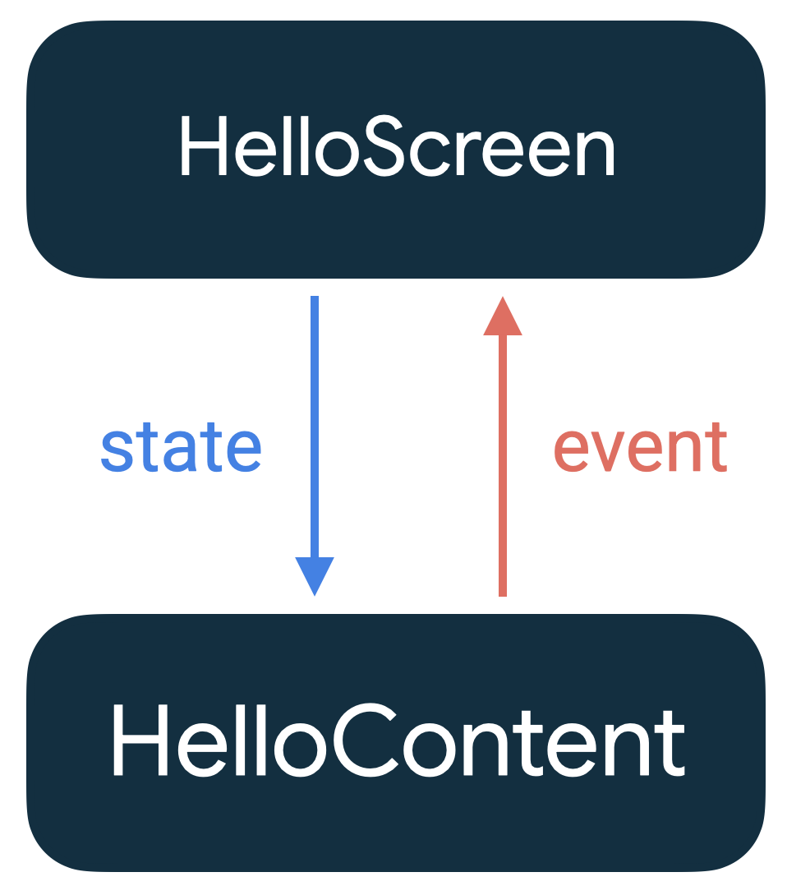

应用中的状态是指可以随时间变化的任何值。这个定义很广泛包括数据库或类中变量的所有内容。

- 当网速不通畅时需要显示一个 Snackbar 给用户
- 博文和相关评论发生变化时
- 用户点击按钮发生的动画

Jetpack Compose 可帮助您明确状态在 Android 应用中的存储位置和使用方式。本指南重点介绍状态与可组合项之间的关联，以及 Jetpack Compose 提供的 API，您可以通过这些 API 更轻松地处理状态。

## 状态和composition

由于Compose 是声明式的，所以当需要改变其任何内容的时候，通过设置新的参数调用同一组声明，这些参数就是 UI 的表现形式。每State 更新时，都会发生重组。

## composable 中的状态

Composable中可以使用```remember```来记住单个对象。系统会在初始化由 ```remember```计算的值存储在Composable中，并在重组的时候返回存储的值。```remember```既可以存储可变对象，也可以存储不可变对象。

!!! Tip
    ```remember```会将对象存储在Composable 中，当调用 ```remember```的Composable被移除后，存储的值也随之消失。

```mutableStateOf```会创建可观察的 ```MutableState<T>```，后者是 Compose 运行时可观察类型。

```kotlin
interface MutableState<T> : State<T> {
    override var value: T
}
```

value 有任何更改，系统会安排重组，读取value 的所有Composable 函数。

在Composable中声明 MutableState 对象有三种方法：

- ```val mutableState = remember { mutableStateOf(default) }```
- ```var value by remember { mutableStateOf(default) }```
- ```val (value, setValue) = remember { mutableStateOf(default) }```

这三种方法是等效的，以语法糖的形式提供不同的用法。使用 by 语法需要导入：

```kotlin
import androidx.compose.runtime.getValue
import androidx.compose.runtime.setValue
```

你可以将状态值作为 Composable 的参数，也可以用作逻辑语句中的判断条件。

```kotlin
@Composable
fun HelloContent() {
   Column(modifier = Modifier.padding(16.dp)) {
       var name by remember { mutableStateOf("") }
       if (name.isNotEmpty()) {
           Text(
               text = "Hello, $name!",
               modifier = Modifier.padding(bottom = 8.dp),
               style = MaterialTheme.typography.h5
           )
       }
       OutlinedTextField(
           value = name,
           onValueChange = { name = it },
           label = { Text("Name") }
       )
   }
}
```

!!! Warning
    虽然```remember```可以在重组后保持状态，但如果是应用的配置更新了，比如屏幕旋转，这时候这个状态也会重置。因此，必须使用 ```rememberSaveable```。
    ```rememberSaveable```会自动保存可保存的 Bundle 中的值。对于其他值，可以将其传入自定义 Saver 对象。

## 其他可观察对象

Jetpack Compose 不强制使用 MutableState<T>存储状态，也支持其他可观察类型。但在 Jetpack Compose 中读取其他可观察类型之前，必须将其转为 State<T>，以便 Jetpack Compose 可以在状态发生变化时自动重组界面。

其他可用的可观察类型：

- [LiveData](https://developer.android.com/reference/kotlin/androidx/compose/runtime/livedata/package-summary)
- [Flow](https://developer.android.com/reference/kotlin/androidx/compose/runtime/package-summary#(kotlinx.coroutines.flow.StateFlow).collectAsState(kotlin.coroutines.CoroutineContext))
- [RxJava2](https://developer.android.com/reference/kotlin/androidx/compose/runtime/rxjava2/package-summary)

!!! Tip
    Compose 是通过读取State<T>对象自动重组界面的。
    如果在 Compose 中使用 LiveData 等其他可观察类型，应该先将其转换为 State<T> 然后再使用。比如 ```LiveData<T>.observeAsState()```。

!!! Warning
    在 Compose 中将可变对象，如 ArrayList<T>或 mutableListOf()等用作状态，可以造成界面无法更新，用户看到的永远是旧的数据。建议使用可观察的数据存储器，如 State<List<T>>和不可变的 listOf()，而不是使用不可观察的可变对象。

## 状态提升

使用```remember```存储对象的 Composable 中创建内部状态，使该Composable有了状态，会在其内部保持和修改自己的状态。在调用者不需要控制和管理状态的情况下，这么操作是可以的。但是一般这种Composable不能复用，也不好测试。

因此如果在编写的组件考虑复用的情况下，应该将状态移到 Composable 组件的调用者，保证Composable本身是无状态的，这种操作叫做状态提升。

Jetpack Compose 中一般的状态提升模式是将状态变量替换为两个参数：

- ```value:T```：要显示的当前值
- ```onValueChange:(T) -> Unit```：请求更改值的事件，其中 T 是建议的新值

其实，并不一定定义为 onValueChange ，需要根据具体的操作来定义更有意义的名称。比如 onExpand 和 onCollapse。

以这种方式提升的状态具有一些重要的属性：

- 单一可信来源：通过移动状态而不是复制状态，来确保只有一个可信的数据来源，可以避免一些 bug
- 封装：只有有状态的Composable能够修改其状态
- 可共享：可与多个Composable共享提升的状态
- 可拦截：无状态Composable的调用者可以在更改状态前决定忽略或修改事件
- 解耦：无状态Composable的状态可以存储在任何位置

在本示例中，您从 HelloContent 中提取 name 和 onValueChange，并按照可组合项的树结构将它们移至可调用 HelloContent 的 HelloScreen 中。

```kotlin
@Composable
fun HelloScreen() {
    var name by rememberSaveable { mutableStateOf("") }

    HelloContent(name = name, onNameChange = { name = it })
}

@Composable
fun HelloContent(name: String, onNameChange: (String) -> Unit) {
    Column(modifier = Modifier.padding(16.dp)) {
        Text(
            text = "Hello, $name",
            modifier = Modifier.padding(bottom = 8.dp),
            style = MaterialTheme.typography.h5
        )
        OutlinedTextField(
            value = name,
            onValueChange = onNameChange,
            label = { Text("Name") }
        )
    }
}
```

通过从 HelloContent 中提升出状态，更容易推断该Composable在不同的情况下重复使用它，以及进行测试。HelloContent 与状态的存储方式解耦。解耦意味着，如果您修改或替换 HelloScreen，不必更改 HelloContent 的实现方式。



状态下降、事件上升的这种模式称为“单向数据流”。在这种情况下，状态会从 HelloScreen 下降为 HelloContent，事件会从 HelloContent 上升为 HelloScreen。通过遵循单向数据流，您可以将在界面中显示状态的可组合项与应用中存储和更改状态的部分解耦。

!!! Note
    > When hoisting state, there are three rules to help you figure out where state should go:

    > State should be hoisted to at least the lowest common parent of all composables that use the state (read).
    
    > If two states change in response to the same events they should be hoisted together.
    
    > State should be hoisted to at least the highest level it may be changed (write).
    
    提升状态时，有三条规则：
    
    1. 状态应至少提升到使用该状态(读取)的所有Composable的最低共同父项
    
    2. 状态应至少提升到它可以发生变化(写入)的最高级别
    
    3. 如果两种状态发生变化以响应相同的事件，它们应该一直提升。


## 恢复状态

在重新创建 Activity 或进程后，可以使用```rememberSaverable```恢复界面状态。

### 存储方式

添加到 Bundle 的所有数据类型都会自动保存。如果要保存无法添加到 Bundle 的内容，可以有以下几种方式

#### Parcelize

最简单的解决方案是向对象添加@Parcelize 注解。

```kotlin
@Parcelize
data class City(val name: String, val country: String) : Parcelable

@Composable
fun CityScreen() {
    var selectedCity = rememberSaveable {
        mutableStateOf(City("Madrid", "Spain"))
    }
}
```

#### MapSaver

如果某种原因导致 `@Parcelize` 不合适，您可以使用 `mapSaver` 定义自己的规则，规定如何将对象转换为系统可保存到 `Bundle` 的一组值。

```kotlin
data class City(val name: String, val country: String)

val CitySaver = run {
    val nameKey = "Name"
    val countryKey = "Country"
    mapSaver(
        save = { mapOf(nameKey to it.name, countryKey to it.country) },
        restore = { City(it[nameKey] as String, it[countryKey] as String) }
    )
}

@Composable
fun CityScreen() {
    var selectedCity = rememberSaveable(stateSaver = CitySaver) {
        mutableStateOf(City("Madrid", "Spain"))
    }
}
```

#### ListSaver

为了避免需要为映射定义键，您也可以使用 `listSaver` 并将其索引用作键：

```kotlin
data class City(val name: String, val country: String)

val CitySaver = listSaver<City, Any>(
    save = { listOf(it.name, it.country) },
    restore = { City(it[0] as String, it[1] as String) }
)

@Composable
fun CityScreen() {
    var selectedCity = rememberSaveable(stateSaver = CitySaver) {
        mutableStateOf(City("Madrid", "Spain"))
    }
}
```


## 管理状态

在前面说到的状态提升，可以简单的把状态进行一定的统一管理。但是如果随着项目功能的丰富，需要跟踪的状态数量也随之增加或者Composable中需要执行业务逻辑时，最好将逻辑和状态事务委派给其他类（状态容器）

下面将介绍如何在 Compose 中以不同方式管理状态。根据Composable的复杂性，需要考虑不同的方案：

- Composables：用于管理简单的界面元素状态
- 状态容器：用于管理复杂的界面元素状态且拥有界面逻辑
- ViewModel：提供对于业务逻辑和 UI 状态的状态容器

状态容器的大小取决于所管理的界面元素的范围，有时候甚至需要将某个状态容器集成到其他状态容器中。

下图所示为 Compose 状态管理所涉及的各实体之间的关系概览。

- Composable可以信赖于0个或多个状态容器，具体取决于其复杂性
- 如果需要访问业务逻辑或UI 状态，则可能需要信赖于 ViewModel
- ViewModel 信赖于业务层或数据层


### 不同类型的状态和逻辑

在 Android 应用中，需要考虑不同类型的状态：

- UI组件状态是组件的提升状态。例如```ScaffoldState```用于处理 ```Scaffold```的状态。
- 界面 UI 状态是界面上需要显示的内容。比如一个商城 APP 上的购物车界面可能包含商品信息、向用户显示的消息或加载标记。该状态通常会和其他层相关联。

此外，逻辑也有不同的类型：

- 界面操作逻辑和 UI 逻辑：如何在屏幕上显示状态。例如，导航逻辑决定显示哪个界面。
- 业务逻辑决定如何处理状态变化，通常位于业务层或数据层，而不应该放在 UI 层

### Composables 作为可信来源

如果状态数量较少和逻辑比较简单，在Composable中直接增加逻辑和状态是可以的，与其相关的交互都应该在这个Composable进行。但是如果将它传递给其他Composable，这就不符合单一可信来源原则，而且会使调试更多困难。

```kotlin
@Composable
fun MyApp() {
    MyTheme {
        val scaffoldState = rememberScaffoldState()
        val coroutineScope = rememberCoroutineScope()

        Scaffold(scaffoldState = scaffoldState) {
            MyContent(
                showSnackbar = { message ->
                    coroutineScope.launch {
                        scaffoldState.snackbarHostState.showSnackbar(message)
                    }
                }
            )
        }
    }
}
```

### 状态容器作为可信来源

当Composable涉及多个界面的状态等复杂逻辑时，应将相应事务委派给状态容器。这样更易于单独对该逻辑进行测试，还降低了Composable的复杂性。保证Composable只是负责展示，而状态容器负责逻辑和状态

在上面 MyApp 的例子中，如果增加更多的逻辑，那么就可以创建一个MyAppState状态容器来管理

```kotlin
// Plain class that manages App's UI logic and UI elements' state
class MyAppState(
    val scaffoldState: ScaffoldState,
    val navController: NavHostController,
    private val resources: Resources,
    /* ... */
) {
    val bottomBarTabs = /* State */

    // Logic to decide when to show the bottom bar
    val shouldShowBottomBar: Boolean
        get() = /* ... */

    // Navigation logic, which is a type of UI logic
    fun navigateToBottomBarRoute(route: String) { /* ... */ }

    // Show snackbar using Resources
    fun showSnackbar(message: String) { /* ... */ }
}

@Composable
fun rememberMyAppState(
    scaffoldState: ScaffoldState = rememberScaffoldState(),
    navController: NavHostController = rememberNavController(),
    resources: Resources = LocalContext.current.resources,
    /* ... */
) = remember(scaffoldState, navController, resources, /* ... */) {
    MyAppState(scaffoldState, navController, resources, /* ... */)
}
```

因为在使用MyAppState 的时候需要使用```remember```来进行信赖，所以通常情况下可以创建一个```rememberMyAppState```方法来直接返回MyAppState实例。

那么现在 MyApp 的代码就可以变得很简单了

```kotlin
@Composable
fun MyApp() {
    MyTheme {
        val myAppState = rememberMyAppState()
        Scaffold(
            scaffoldState = myAppState.scaffoldState,
            bottomBar = {
                if (myAppState.shouldShowBottomBar) {
                    BottomBar(
                        tabs = myAppState.bottomBarTabs,
                        navigateToRoute = {
                            myAppState.navigateToBottomBarRoute(it)
                        }
                    )
                }
            }
        ) {
            NavHost(navController = myAppState.navController, "initial") { /* ... */ }
        }
    }
}
```

### ViewModel 作为可信来源

ViewModel 是一种特殊的状态容器，主要负责：

- 对应用的业务逻辑或数据进行处理，这个逻辑通常是在业务层或数据层
- 处理即将在界面上展示的应用数据

ViewModel 的生命周期往往是比较长的，原因是它们在配置发生变化后仍然有效。ViewModel 可以遵循 Activity、Fragment、或导航（如果使用了[导航库](https://developer.android.com/jetpack/compose/navigation)）的生命周期。正因为 ViewModel 的生命周期较长，因此不应该长期持有和 Composable 密切相关的一些状态，否则，可以会导致内存泄漏。

```kotlin
data class ExampleUiState(
    dataToDisplayOnScreen: List<Example> = emptyList(),
    userMessages: List<Message> = emptyList(),
    loading: Boolean = false
)

class ExampleViewModel(
    private val repository: MyRepository,
    private val savedState: SavedStateHandle
) : ViewModel() {

    var uiState by mutableStateOf<ExampleUiState>(...)
        private set

    // Business logic
    fun somethingRelatedToBusinessLogic() { ... }
}

@Composable
fun ExampleScreen(viewModel: ExampleViewModel = viewModel()) {

    val uiState = viewModel.uiState
    ...

    Button(onClick = { viewModel.somethingRelatedToBusinessLogic() }) {
        Text("Do something")
    }
}
```

!!! Tip
    如果 ViewModel 中包含要在进程重建后保留的状态，请使用```SavedStateHandle```。


## 更多

https://developer.android.com/jetpack/compose/state