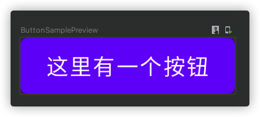
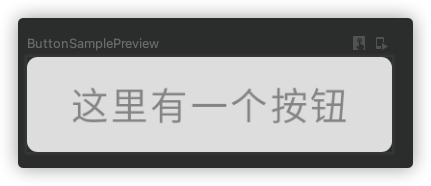
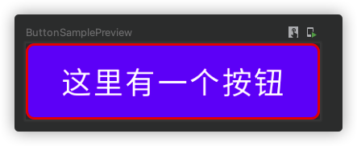
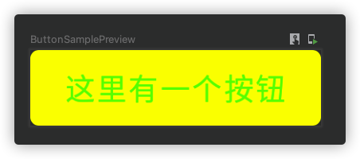
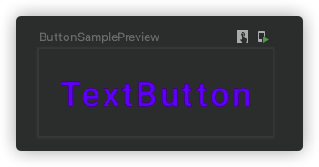
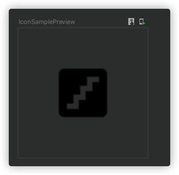

## Button

### 属性

```kotlin
@Composable
fun Button(
    onClick: () -> Unit,
    modifier: Modifier = Modifier,
    enabled: Boolean = true,
    interactionSource: MutableInteractionSource = remember { MutableInteractionSource() },
    elevation: ButtonElevation? = ButtonDefaults.elevation(),
    shape: Shape = MaterialTheme.shapes.small,
    border: BorderStroke? = null,
    colors: ButtonColors = ButtonDefaults.buttonColors(),
    contentPadding: PaddingValues = ButtonDefaults.ContentPadding,
    content: @Composable RowScope.() -> Unit
): Unit
```

### 基本用法

```kotlin
@Composable
fun ButtonSample() {
    Button(
        onClick = {
            Log.d("ButtonSample", "click the button")
        },
    ) {
        Text(text = "这里有一个按钮")
    }
}
```



### 参数

- ```enabled``` 是否启用或禁用

<figure markdown>
  
  <figcaption>禁用状态</figcaption>
</figure>

- ```elevation``` 投影
- ```border``` 边框线
```kotlin
@Composable
fun ButtonSample() {
    Button(
        onClick = {
            Log.d("ButtonSample", "click the button")
        },
        border = BorderStroke(1.dp,Color.Red)
    ) {
        Text(text = "这里有一个按钮")
    }
}
```



- ```colors```设置颜色，可以设置背景颜色、前景颜色、禁用状态和启动状态下的颜色
```kotlin
@Composable
fun ButtonSample() {
    Button(
        onClick = {
            Log.d("ButtonSample", "click the button")
        },
        colors = ButtonDefaults.buttonColors(
            backgroundColor = Color.Yellow,
            contentColor = Color.Green
        )
    ) {
        Text(text = "这里有一个按钮")
    }
}
```



- ```contentPadding``` 内容内间距

## TextButton

```TextButton```一般是用来显示文字按钮的
```kotlin
@Composable
fun ButtonSample() {
    TextButton(
        onClick = {
            Log.d("ButtonSample", "click the button")
        },
    ) {
        Text(text = "TextButton")
    }
}
```




## OutlinedButton

```kotlin
@Composable
fun ButtonSample() {
    OutlinedButton(
        onClick = {
            Log.d("ButtonSample", "click the button")
        },
    ) {
        Text(text = "OutlinedButton")
    }
}
```

## IconButton

用来显示图标按钮

```kotlin
@Composable
fun ButtonSample() {
    IconButton(
        onClick = {
            Log.d("ButtonSample", "click the button")
        },
    ) {
        Icon(imageVector = Icons.Default.Stairs, contentDescription = null)
    }
}
```

