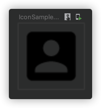
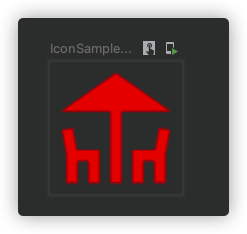

## 属性

```kotlin
@Composable
fun Icon(
    imageVector: ImageVector,//bitmap: ImageBitmap,painter: Painter,
    contentDescription: String?,
    modifier: Modifier = Modifier,
    tint: Color = LocalContentColor.current.copy(alpha = LocalContentAlpha.current)
)
```

## 用法

#### 用法一

可以直接引用[官方的图标库](https://fonts.google.com/icons) ，例如：```Icons.Default.AccountBox```

```kotlin
@Composable
fun IconSample() {
    Icon(imageVector = Icons.Default.AccountBox, contentDescription = null)
}
```



在官方网站上，我们看到提供的图标库中，有些可能无法正常显示。是因为默认 SDK 中只是包含部分图标，如果需要使用更多图标需要引入扩展库

```groovy
implementation "androidx.compose.material:material-icons-extended:$compose_version"	
```

### 用法二

可以使用 drawble 里面的图片

```kotlin
@Composable
fun IconSample() {
  Icon(
    painter = painterResource(id = R.drawable.ic_android_black_24dp),
    contentDescription = null,
    tint = Color.Blue
  )
}
```

### 用法三

可以引用 ImageBitmap

```kotlin
@Composable
fun IconSample() {
    var bitmap:ImageBitmap ? = null
    with(LocalContext.current){
         bitmap = ImageBitmap.imageResource(resources,R.drawable.newbanner4)
    }
    bitmap?.let { Icon(bitmap = it, contentDescription = null) }
}
```

## 参数

- ``` tint ``` 设置图标颜色

```kotlin
@Composable
fun IconSample() {
    Icon(imageVector = Icons.Default.Deck, contentDescription = null, tint = Color.Red)
}
```



