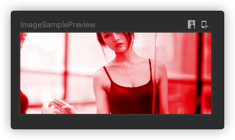

## 属性

```kotlin
@Composable
fun Image(
    painter: Painter,
    contentDescription: String?,
    modifier: Modifier = Modifier,
    alignment: Alignment = Alignment.Center,
    contentScale: ContentScale = ContentScale.Fit,
    alpha: Float = DefaultAlpha,
    colorFilter: ColorFilter? = null
): Unit
```

图片跟 Icon 差不多也可以通过三种方式引入图片，本页只展示一种方式

### 参数

- contentScale 设置图片的伸展方式：ContentScale.Inside、ContentScale.Crop 等
- colorFilter 设置颜色滤镜

```kotlin
@Composable
fun ImageSample() {
    Image(
        painter = painterResource(id = R.drawable.newbanner4),
        contentDescription = null,
        contentScale = ContentScale.Inside,
        colorFilter = ColorFilter.tint(Color.Red, blendMode = BlendMode.Color)
    )
}
```

