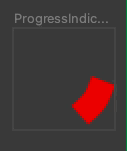
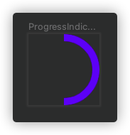
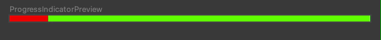
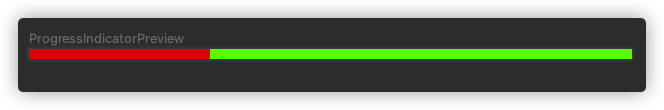

## CircularProgressIndicator

### 属性

```kotlin
@Composable
fun CircularProgressIndicator(
    progress: Float?,
    modifier: Modifier? = Modifier,
    color: Color? = MaterialTheme.colors.primary,
    strokeWidth: Dp? = ProgressIndicatorDefaults.StrokeWidth
): Unit
```

### 参数

- progress 当前进度0.0~1.0之间，不传递为滚动进度
- color 进度条颜色 
- strokeWidth 进度条大小

```kotlin
@Composable
fun CircularProgressIndicatorSample() {
    CircularProgressIndicator(
        color = Color.Red, strokeWidth = 10.dp
    )
}
```



不传 porgress参数情况

```kotlin
@Composable
fun CircularProgressIndicatorSample1() {
    CircularProgressIndicator(progress = 0.5f)
}
```



## LinearProgressIndicator

```kotlin
@Composable
fun LinearProgressIndicatorSample() {
    LinearProgressIndicator(color = Color.Red, backgroundColor = Color.Green)
}
```



```kotlin
@Composable
fun LinearProgressIndicatorSample1() {
    LinearProgressIndicator(progress = 0.3f, color = Color.Red, backgroundColor = Color.Green)
}
```

