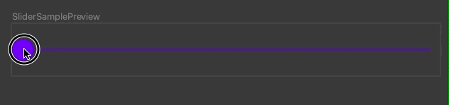
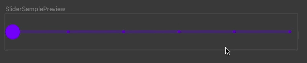
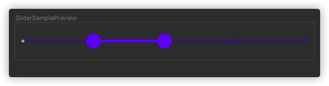

## 属性

```kotlin
@Composable
fun Slider(
    value: Float,
    onValueChange: (Float) -> Unit,
    modifier: Modifier = Modifier,
    enabled: Boolean = true,
    valueRange: ClosedFloatingPointRange<Float> = 0f..1f,
    /*@IntRange(from = 0)*/
    steps: Int = 0,
    onValueChangeFinished: (() -> Unit)? = null,
    interactionSource: MutableInteractionSource = remember { MutableInteractionSource() },
    colors: SliderColors = SliderDefaults.colors()
) :Unit
```

## 参数

- value 当前值
- valueRange 可选值的范围，默认是0f~1f
- steps 步频

```kotlin
@Composable
fun SliderSample() {
    var value by remember {
        mutableStateOf(0f)
    }
    Slider(value = value, onValueChange = {
        value = it
    }, valueRange = 0f..100f, steps = 4)
}
```


<figure markdown>
  
  <figcaption>未设置 Steps</figcaption>
</figure>

<figure markdown>
  
  <figcaption>设置 Steps</figcaption>
</figure>
## RangeSlider

范围选择器

因为还是个实验性的 API，所以需要增加```@OptIn(ExperimentalMaterialApi::class)```

```kotlin
@OptIn(ExperimentalMaterialApi::class)
@Composable
fun SliderSample2() {
  	//注意此时值是一个范围
    var values by remember {
        mutableStateOf(5f..10f)
    }
    RangeSlider(values = values, onValueChange = {
        values = it
    }, valueRange = 0f..30f,steps = 3)
}
```


