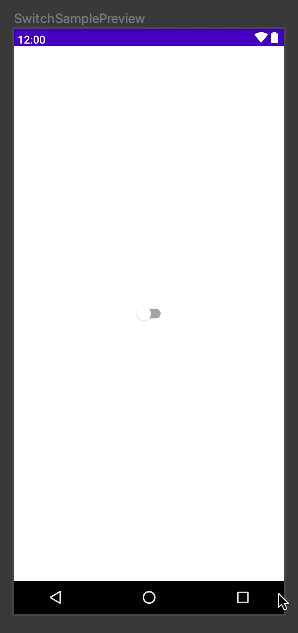

## 属性

```kotlin
@Composable
fun Switch(
    checked: Boolean?,
    onCheckedChange: ((Boolean) -> Unit)?,
    modifier: Modifier? = Modifier,
    enabled: Boolean? = true,
    interactionSource: MutableInteractionSource? = remember { MutableInteractionSource() },
    colors: SwitchColors? = SwitchDefaults.colors()
): Unit
```

## 用法

```kotlin
@Composable
fun SwitchSample() {
  	//声明一个变量来记住选中状态
    var switch by remember { mutableStateOf(false) }
    Switch(checked = switch, onCheckedChange = {
      	//当进行切换操作时，更改状态
        switch = it
    })
}
```



## 更多

[Switch](https://developer.android.com/reference/kotlin/androidx/compose/material/package-summary#Switch(kotlin.Boolean,kotlin.Function1,androidx.compose.ui.Modifier,kotlin.Boolean,androidx.compose.foundation.interaction.MutableInteractionSource,androidx.compose.material.SwitchColors))

