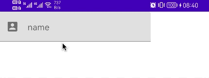
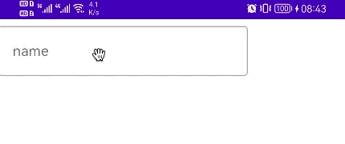
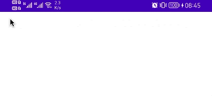

## 属性

```kotlin
@Composable
fun TextField(
    value: String?,
    onValueChange: ((String) -> Unit)?,
    modifier: Modifier? = Modifier,
    enabled: Boolean? = true,
    readOnly: Boolean? = false,
    textStyle: TextStyle? = LocalTextStyle.current,
    label: (@Composable () -> Unit)? = null,
    placeholder: (@Composable () -> Unit)? = null,
    leadingIcon: (@Composable () -> Unit)? = null,
    trailingIcon: (@Composable () -> Unit)? = null,
    isError: Boolean? = false,
    visualTransformation: VisualTransformation? = VisualTransformation.None,
    keyboardOptions: KeyboardOptions? = KeyboardOptions.Default,
    keyboardActions: KeyboardActions? = KeyboardActions(),
    singleLine: Boolean? = false,
    maxLines: Int? = Int.MAX_VALUE,
    interactionSource: MutableInteractionSource? = remember { MutableInteractionSource() },
    shape: Shape? = MaterialTheme.shapes.small.copy(bottomEnd = ZeroCornerSize, bottomStart = ZeroCornerSize),
    colors: TextFieldColors? = TextFieldDefaults.textFieldColors()
): Unit
```

## 参数

- enabled 是否启用禁用，无法聚集，不可编辑，无法复制
- readOnly 是否只读，不可编辑，可复制 
- textStyle 设置文本样式
- lable 显示在输入框边框的文本（可选）
- placeHolder 未输入状态下提示文字
- leadingIcon 显示在输入框左侧的图标
- trailingIcon 显示在输入框右侧的图标
- keyboradOptions 键盘类型，如数字键盘
- keyboradActions 功能键事件监听
- singleLine 是否单行显示，如果设置为 true，则忽略maxLines
- maxLines 大于等于1

```kotlin
@Composable
fun TextFieldSample() {
    //接收用户输入的值
    var name by remember { mutableStateOf("") }

    TextField(
        value = name,
        onValueChange = {
            name = it
        },
        label = {
            Text("name")
        },
        placeholder = {
            Text(text = "pls input name")
        },
        leadingIcon = {
            Icon(imageVector = Icons.Default.AccountBox, contentDescription = null)
        },
        keyboardActions = KeyboardActions(onDone = {

        }),
        keyboardOptions = KeyboardOptions(keyboardType = KeyboardType.Number),
        singleLine = true,
    )
}
```



## OutlinedTextField

与 TextField 只是样式不同

```kotlin
@Composable
fun TextFieldSample() {
    var name by remember { mutableStateOf("") }
    OutlinedTextField(value = name, onValueChange = {
        name = it
    },label = {Text("name")})
}
```



## BasicTextField

最原始的文本输入控件，可以进行深度自定义

```kotlin
@Composable
fun TextFieldSample3() {
    var name by remember { mutableStateOf("") }
    BasicTextField(value = name, onValueChange = {
        name = it
    })
}
```



## 更多

[TextField](https://developer.android.com/reference/kotlin/androidx/compose/material/package-summary#TextField(kotlin.String,kotlin.Function1,androidx.compose.ui.Modifier,kotlin.Boolean,kotlin.Boolean,androidx.compose.ui.text.TextStyle,kotlin.Function0,kotlin.Function0,kotlin.Function0,kotlin.Function0,kotlin.Boolean,androidx.compose.ui.text.input.VisualTransformation,androidx.compose.foundation.text.KeyboardOptions,androidx.compose.foundation.text.KeyboardActions,kotlin.Boolean,kotlin.Int,androidx.compose.foundation.interaction.MutableInteractionSource,androidx.compose.ui.graphics.Shape,androidx.compose.material.TextFieldColors))