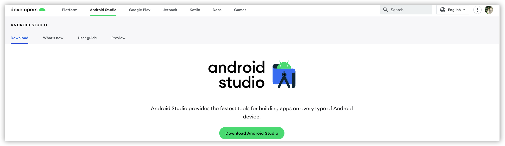
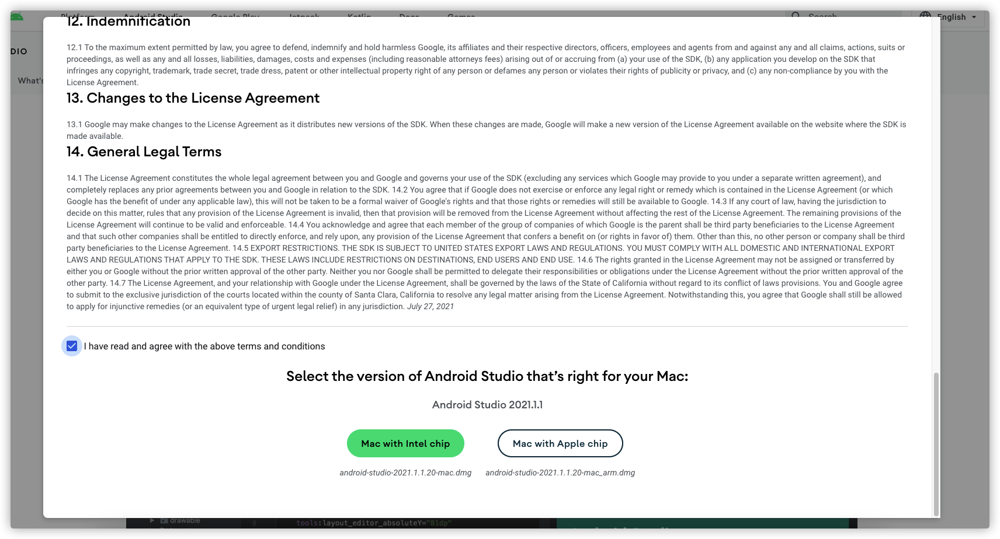

## 网络条件

在学习 Jetpack Compose 之前，建议最好准备梯子，因为首先第一步下载Android Studio 就需要爬梯子，包括后续的查看官方文档的过程中也是需要梯子的。

当然没有的情况下也不是不能学习。

## 下载 Android Studio

[官方下载地址](https://developer.android.com/studio)

点击上面的地址直达页面下载最新版本的，如果电脑上已经安装了 Android Studio，一定要确定版本是```Arctic Fox | 2020.3.1```之后的版本（包含）。

点击 Download Android Sudio



勾选同意协议， 根据自己的电脑 CPU 型号进行选择下载



## 安装 Android Studio

双击 dmg 镜像文件后拖动Android Studio.app 放到应用程序中即可

## 配置