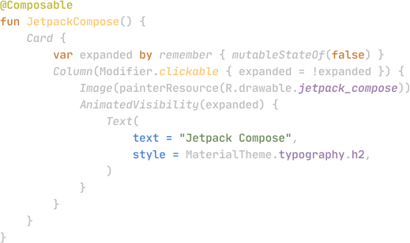

## Jetpack Compose 是什么？

!!! cite
    Jetpack Compose 是用于构建原生 Android 界面的新工具包。它可简化并加快 Android 上的界面开发，使用更少的代码、强大的工具和直观的 Kotlin API，快速让应用生动而精彩。

!!! Example
    

    
    

## 前置条件

* 会 kotlin 语言
* 最好会 Android App开发经验，至少应该有移动 APP 开发经验

