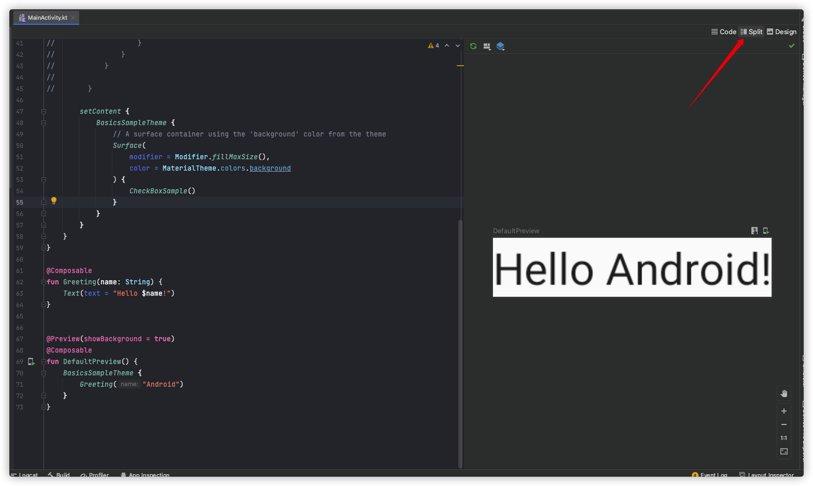
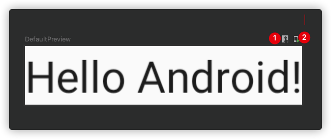

## 你的第一次

## Compose 项目与传统项目的区别

原始 xml 布局项目中，在 Activity 需要展示某个布局时通过 ```setContentView(R.layout.main)```来设置一个布局或 ```View```

而 Compose 下则使用 ```setContent```，接收的是一个 Composable

```kotlin
setContent {
  ComposeExampleTheme {
    TextDemo()
  }
}
```

## Composable 函数

Composable 函数是构建 Jetpack Compose 应用的基础模块。

这些函数让你通过描述形状和数据信赖性定义应用程序的界面，而不是专注于界面的构建过程。只需要在函数上面添加```@Composable```注解，就可以让这个函数成为一个 Composable

## Theme

项目默认会自动使用项目名称创建一个主题，如果想自定义主题可以对名称及里面的文字、颜色等进行定义。

## 预览界面

通过在函数前面使用```@Preview```注解来标识函数为预览。此时在右侧将显示预览窗口，如果当前状态是在Code下，则需要点击右上角工具栏中的 Split 或 Design 展示预览界面。


```@Preview``` 可以使用一些参数在达到不同的目的

```kotlin
@Composable
@Preview(name= "预览名称", showSystemUi = true, group = "group1", device = Devices.NEXUS_7)
fun TextDemoPreview(){
    TextDemo()
}
```

- ``` name ``` :设置预览名称
- ``` showSystemUI = true ```: 设置是否显示系统界面
- ``` showBackground ``` 和 ``` backgroundColor```: 设置背景颜色，此项和 showSystemUI 互斥
- ``` widthDp ```和``` heightDp ```:设置预览模块大小，此项和 showSystemUI 互斥
- ``` group ```:设置分级
- ``` device ```:设置预览设备


接下来，我们可以看到在预览界面上有两个按钮

1. 按钮1是进入交互模式，可以直接在预览界面进行操作
2. 按钮2是将当前预览界面直接运行到设备上，而忽略 MainActivity 指定的界面



!!! Tip
    预览界面的交互操作，不是所有操作都支持的